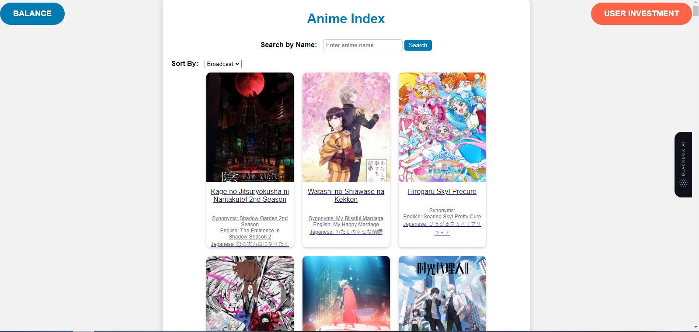
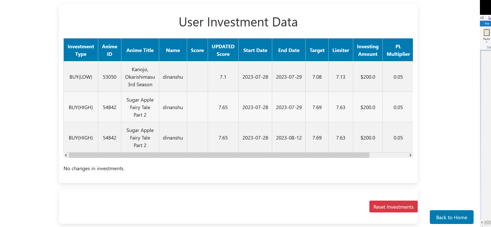
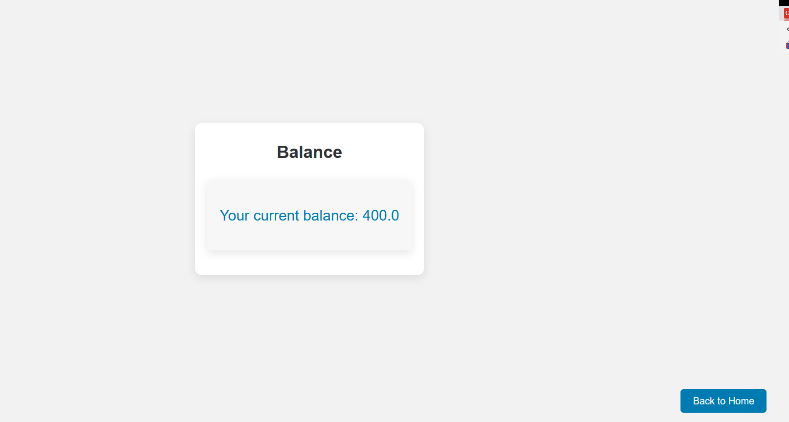
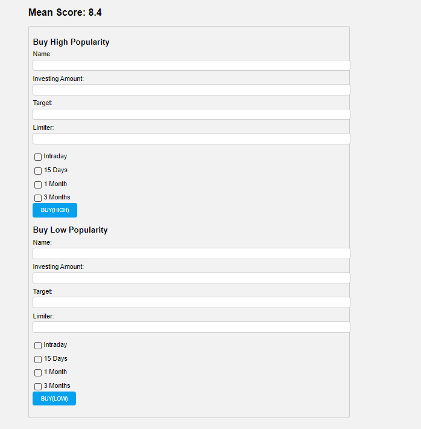
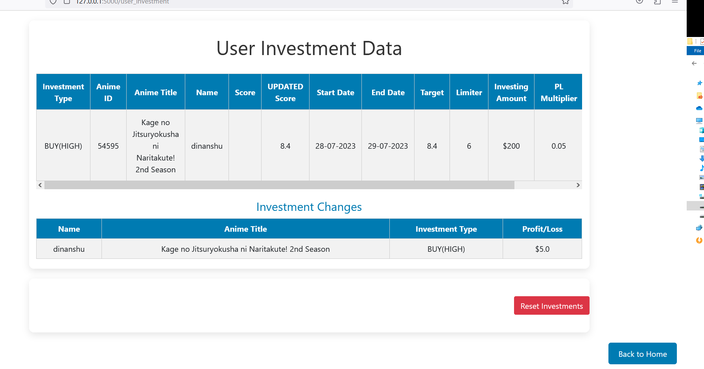

# Anime Stock Market Web Application

## Overview

The Anime Stock Market Web Application is a fun and interactive web application that allows users to explore and visualize stock market data for various anime titles. It provides users with an engaging and visually appealing way to analyze the performance of anime shows and execute virtual buy_high and buy_low orders directly from the interactive chart.



## Features

- **Interactive Charts:** The web application uses Plotly to create interactive and dynamic charts that enable users to explore stock market data visually. Users can hover over data points to view detailed information and gain insights into the performance of anime titles.

- **Buy Orders:** Users have the ability to execute virtual buy_high and buy_low orders directly from the chart. By clicking on a data point, a dialog box appears, allowing users to enter the anime title, target price, and investing amount. The application then executes the buy order based on the user's selection.

- **User Investment Tracking:** The application allows users to track their virtual investments and monitor their portfolio's performance. Users can view their balance and the anime titles they have invested in.

- **Mean Score Analysis:** The Mean Score section displays the average score of the anime titles in the dataset, giving users an idea of the overall anime performance in the stock market.

## Prerequisites

- Python 3.7 or higher
- Flask web framework
- Plotly library
- Pandas library
- Numpy library

## Getting Started

To run the Anime Stock Market Web Application on your local machine, follow these steps:

1. Clone this repository to your local machine using the following command:

   ```
   git clone https://github.com/your-username/anime-stock-market.git](https://github.com/NameawaShinderu/ANIME-TRADING-SITE.git
   ```

2. Change into the project directory:

   ```
   cd ANIME-TRADING-SITE
   ```

3. Install the required dependencies using pip:

   ```
   pip install -r requirements.txt
   ```

4. Run the Flask application:

   ```
   python app.py
   ```

5. Open your web browser and navigate to `http://localhost:5000`.

## Usage

1. On the homepage, click on the "Search" button to find anime data.

2. Explore the interactive charts on the results page by hovering over data points to view detailed information about each anime title.

3. To make a virtual buy order, click on a data point in the chart. A dialog box will appear, allowing you to enter the anime title, target price, and investing amount. Choose between buy_high and buy_low, and the application will execute the order.

4. Visit the "User Investment" page to view your virtual portfolio and track the performance of your investments.







## Contributing

We welcome contributions to the Anime Stock Market Web Application! If you find any bugs, have feature requests, or want to make improvements, please follow our [contribution guidelines](CONTRIBUTING.md).

## License

This project is licensed under the MIT License - see the [LICENSE](LICENSE) file for details.

## Acknowledgments

We would like to thank the developers of Flask, Plotly, Pandas, and Numpy for their excellent libraries that made this project possible.

Special thanks to the Anime Database API for providing the anime data used in this application.

---

Feel free to customize this README with any additional information you'd like to provide for your project. Good luck and happy coding!
